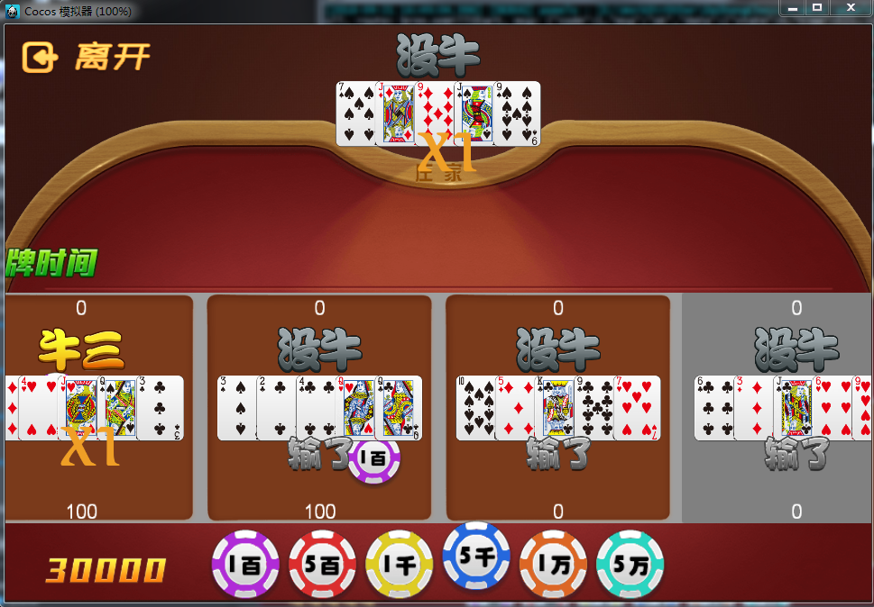

# 百人牛牛项目
*  此项目是棋牌，是pomelo + cocos creator学习最佳入门项目
*  服务器api接口文档参考: doc/棋牌服务器API.md

## 服务器环境搭建

### 1) 安装依赖
*  node 版本:6.11.1
*  sh 1-cnpm-install  (npm网速太慢安装不上，只好使用cnpm安装)
*  新建logs目录，不然运行报错

### 2)导入数据库
*  mysql版本: 5.6+
*  进入mysql终端，登陆mysql，并且用source命令导入数据库
   
```
   
➜  ~ mysql -u root -p
Enter password: jianan
Welcome to the MySQL monitor.  Commands end with ; or \g.
Your MySQL connection id is 6
Server version: 5.7.20 MySQL Community Server (GPL)

Copyright (c) 2000, 2017, Oracle and/or its affiliates. All rights reserved.

Oracle is a registered trademark of Oracle Corporation and/or its
affiliates. Other names may be trademarks of their respective
owners.

Type 'help;' or '\h' for help. Type '\c' to clear the current input statement.

mysql> source /Users/jianan/Documents/study/NiuNiu-creator-pomelo/game-server/app/dao/mysql/chess.sql
Query OK, 1 row affected (0.00 sec)

Database changed
Query OK, 0 rows affected (0.00 sec)

Query OK, 0 rows affected (0.00 sec)
```

### 3)修改项目中对mysql的连接设置
game-server/config/mysql.json
把该文件中的`user`和`password`修改为上一步中mysql设置的用户名和密码

### 4)运行服务器
```
cd chess/game-server
pomelo start
```
到这里，如果不出意外，服务器就安装结束并且启动啦

## 客户端开发环境
*  CocosCreator版本: 1.9.3
*  效果图:



